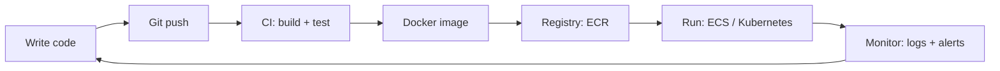

# DevOps Roadmap: from zero to shipping real apps

Simple rules for this journey:
- One small lesson at a time.
- You type all the code. I explain and review.
- Tick a box `[x]` only when you can explain the lesson in your own words.

## The big picture

DevOps = **Dev**elopment + **Op**eration**s**.
Goal: code goes from your laptop to real users **fast, safe, and automatically**.

Each phase below teaches one box of this picture.

How to read each lesson:
- **Learn**: the ideas we cover
- **Words**: new jargon you will know
- **Do**: the hands-on task you type yourself
- **You can now**: the skill you walk away with

---

## Phase 0: Foundations (the ground you stand on)

Why: almost every server in the world runs Linux. Every DevOps tool assumes you are comfortable in a terminal.

### 0.1 Terminal and moving around
- **Learn**: what a terminal and a shell are, folders as a tree, where you are, how to move
- **Words**: terminal, shell, Bash, path, absolute vs relative path, home folder `~`
- **Do**: `pwd`, `ls`, `ls -la`, `cd`, `cd ..`, `cd ~`
- **You can now**: find any file on a machine without a mouse
- [ ] done

### 0.2 Working with files
- **Learn**: create, read, copy, move, delete files and folders
- **Words**: flag (like `-r`), wildcard `*`, hidden file (starts with `.`)
- **Do**: `touch`, `mkdir -p`, `cat`, `less`, `cp`, `mv`, `rm -r`, `nano`
- **You can now**: manage files on a server through SSH
- [ ] done

### 0.3 Searching and pipes
- **Learn**: find text in files, chain small commands together
- **Words**: pipe `|`, redirect `>` and `>>`, stdout, stderr
- **Do**: `grep`, `find`, `wc -l`, `sort`, `head`, `tail -f`
- **You can now**: search a huge log file for errors in seconds
- [ ] done

### 0.4 Users and permissions
- **Learn**: who owns a file, who can read, write, or run it
- **Words**: user, group, root, `sudo`, `rwx`, `755`, `644`
- **Do**: `ls -l`, `chmod`, `chown`, `whoami`, `sudo`
- **You can now**: fix "Permission denied" errors yourself
- [ ] done

### 0.5 Processes and services
- **Learn**: what a running program is, how to see it and stop it, programs that run in the background
- **Words**: process, PID, signal, service, daemon, systemd
- **Do**: `ps aux`, `top`, `kill`, `systemctl status/start/stop`
- **You can now**: find what is eating CPU and restart a broken service
- [ ] done

### 0.6 Packages and environment variables
- **Learn**: installing software, settings passed to programs from outside
- **Words**: package manager (`apt`, `apk`, `brew`), environment variable, `PATH`
- **Do**: `apt install`, `export NAME=value`, `echo $NAME`, `env`
- **You can now**: install tools and configure apps without editing code
- [ ] done

### 0.7 Networking basics
- **Learn**: how computers find and talk to each other
- **Words**: IP address, port, DNS, HTTP vs HTTPS, TCP, localhost, `0.0.0.0`
- **Do**: `ping`, `curl`, `dig`, `nslookup`, `ss -tulpn`
- **You can now**: tell whether a problem is "app is down" or "network is blocked"
- [ ] done

### 0.8 SSH
- **Learn**: logging into a remote computer safely
- **Words**: SSH, public key, private key, `known_hosts`
- **Do**: `ssh-keygen`, `ssh user@host`, `scp`
- **You can now**: log into any cloud server from your laptop
- [ ] done

### 0.9 Bash scripting
- **Learn**: saving commands in a file so they run by themselves
- **Words**: script, shebang `#!/bin/bash`, variable, `if`, `for` loop, exit code
- **Do**: a script that backs up a folder with today's date in the name
- **You can now**: automate boring repeated work
- [ ] done

- [ ] **Phase 0 done**

---

## Phase 1: Git (a time machine for your code)

Why: every pipeline starts with a `git push`. No Git means no CI/CD.

### 1.1 What Git is
- **Learn**: why we save versions, how Git stores snapshots
- **Words**: repository (repo), commit, working folder, staging area
- **Do**: `git init`, `git status`, `git add`, `git commit`, `git log`
- **You can now**: save and look back at every change you ever made
- [ ] done

### 1.2 Undoing mistakes
- **Learn**: go back to an older version safely
- **Words**: HEAD, diff, restore, revert
- **Do**: `git diff`, `git restore`, `git revert`
- **You can now**: recover from a bad change without panic
- [ ] done

### 1.3 Branches and merging
- **Learn**: work on a safe copy, then join it back
- **Words**: branch, `main`, merge, merge conflict
- **Do**: `git switch -c`, `git merge`, fix a conflict by hand
- **You can now**: build a feature without breaking working code
- [ ] done

### 1.4 GitHub and teamwork
- **Learn**: sharing code online, reviewing each other's work
- **Words**: remote, `origin`, push, pull, pull request (PR), code review
- **Do**: push a repo to GitHub, open a PR, merge it
- **You can now**: work with a team the way real companies do
- [ ] done

### 1.5 `.gitignore` and good habits
- **Learn**: what must never go into Git (passwords, build files)
- **Words**: `.gitignore`, secret leak, commit message
- **Do**: write a `.gitignore` for a Java project
- **You can now**: keep repos clean and safe
- [ ] done

- [ ] **Phase 1 done**

---

## Phase 2: Docker (packing the app in a box)

Why: "it works on my machine" goes away. The same box runs on any computer.

### 2.1 Image vs container
- **Learn**: what a container is, how it differs from a virtual machine
- **Words**: image, container, VM, Docker Engine, Docker Hub
- **Do**: `docker run hello-world`, `docker ps`, `docker images`
- **You can now**: run any app without installing it on your laptop
- [ ] done

### 2.2 Writing a Dockerfile
- **Learn**: the recipe that builds an image, line by line
- **Words**: `FROM`, `WORKDIR`, `COPY`, `RUN`, `CMD`, `EXPOSE`, build context
- **Do**: Dockerfile for a small app, `docker build -t myapp:v1 .`
- **You can now**: package your own app
- [ ] done

### 2.3 Layers and caching
- **Learn**: why line order makes builds fast or slow
- **Words**: layer, cache, `.dockerignore`
- **Do**: reorder a Dockerfile and time the build before and after
- **You can now**: write Dockerfiles that rebuild in seconds
- [ ] done

### 2.4 Multi-stage builds
- **Learn**: build with big tools, ship only the result
- **Words**: stage, `AS builder`, `COPY --from`, JDK vs JRE
- **Do**: Java app built with Maven + JDK, run on a JRE image, compare sizes
- **You can now**: make small, safer images
- [ ] done

### 2.5 Tags and registries
- **Learn**: naming versions, storing images online
- **Words**: tag, `latest`, registry, repository, push, pull
- **Do**: tag with a git commit hash, push to Docker Hub
- **You can now**: version images and roll back
- [ ] done

### 2.6 Ports, volumes, env vars
- **Learn**: opening the app to the outside, keeping data, passing settings
- **Words**: port mapping `-p`, volume `-v`, `-e`, ephemeral
- **Do**: run Postgres that keeps its data after a restart
- **You can now**: run real apps with databases
- [ ] done

### 2.7 Debugging containers
- **Learn**: what to do when a container crashes
- **Words**: logs, exit code, `exec`, inspect
- **Do**: `docker logs`, `docker exec -it`, `docker inspect`
- **You can now**: find out why a container died
- [ ] done

### 2.8 Docker Compose
- **Learn**: start many containers together from one file
- **Words**: `docker-compose.yml`, service, network, `depends_on`
- **Do**: app + database with one `docker compose up`
- **You can now**: run a full local setup with one command
- [ ] done

- [ ] **Phase 2 done** (2.1, 2.4, 2.5 partly discussed in chat)

---

## Phase 3: CI/CD (the robot that builds and ships)

CI = Continuous Integration: build and test on every push.
CD = Continuous Delivery/Deployment: ship it automatically.

### 3.1 What a pipeline is
- **Learn**: the stages every pipeline has, and why automating them matters
- **Words**: pipeline, stage, job, step, trigger, artifact
- **Do**: draw your own pipeline on paper
- **You can now**: explain CI/CD in an interview
- [ ] done

### 3.2 GitHub Actions basics
- **Learn**: a CI tool built into GitHub
- **Words**: workflow, `.github/workflows/*.yml`, runner, `on: push`
- **Do**: run tests automatically on every push
- **You can now**: catch broken code before it merges
- [ ] done

### 3.3 Build and push an image in CI
- **Learn**: the robot builds your Docker image and stores it
- **Words**: secrets in CI, registry login
- **Do**: workflow that builds and pushes an image tagged with the commit hash
- **You can now**: never build images by hand again
- [ ] done

### 3.4 Jenkins basics
- **Learn**: the older, very common CI server used in many companies
- **Words**: Jenkins controller, agent, `Jenkinsfile`, declarative pipeline, plugin
- **Do**: run Jenkins in Docker, write a `Jenkinsfile` with build → test → docker build
- **You can now**: read and fix Jenkins pipelines at work
- [ ] done

### 3.5 Deployment strategies
- **Learn**: ways to release without downtime
- **Words**: rolling update, blue/green, canary, rollback
- **Do**: compare the strategies on paper with a real example
- **You can now**: choose a safe release method
- [ ] done

- [ ] **Phase 3 done** (Jenkins idea discussed in chat)

---

## Phase 4: Cloud with AWS (renting computers)

Why: most companies don't own servers. They rent them.

### 4.1 What the cloud is
- **Learn**: renting vs owning servers, how billing works
- **Words**: region, availability zone (AZ), free tier, billing alarm
- **Do**: make an AWS account and set a billing alarm first
- **You can now**: use AWS without surprise bills
- [ ] done

### 4.2 IAM (who can do what)
- **Learn**: users, roles, and permissions
- **Words**: IAM user, role, policy, MFA, root account
- **Do**: create a user with limited rights, turn on MFA
- **You can now**: give access safely
- [ ] done

### 4.3 AWS CLI
- **Learn**: control AWS from the terminal instead of clicking
- **Words**: CLI, access key, profile
- **Do**: `aws configure`, `aws s3 ls`
- **You can now**: script anything in AWS
- [ ] done

### 4.4 EC2 (one rented computer)
- **Learn**: start a server, log in, run an app on it
- **Words**: instance, AMI, instance type, key pair, user data
- **Do**: launch EC2, SSH in, run your Docker image there
- **You can now**: host an app on the internet
- [ ] done

### 4.5 VPC and security groups (your private network)
- **Learn**: how traffic gets in and out
- **Words**: VPC, subnet (public/private), CIDR, internet gateway, NAT, security group
- **Do**: open only ports 22 and 80 to your server
- **You can now**: lock down a server's network
- [ ] done

### 4.6 S3 (file storage)
- **Learn**: storing files forever and cheaply
- **Words**: bucket, object, bucket policy, versioning
- **Do**: upload a file, keep it private, turn on versioning
- **You can now**: store backups and static files
- [ ] done

### 4.7 ECR (image storage)
- **Learn**: AWS's own Docker registry
- **Words**: ECR repository, lifecycle policy, image scan
- **Do**: push your image to ECR, add a "keep last 30" rule
- **You can now**: store images where AWS can pull them
- [ ] done

### 4.8 ECS (AWS runs your containers)
- **Learn**: run containers without managing servers
- **Words**: cluster, task definition, task, service, Fargate
- **Do**: deploy your ECR image on ECS Fargate
- **You can now**: run a production-style container app
- [ ] done

### 4.9 Load balancer and auto scaling
- **Learn**: spread users across copies, add copies when busy
- **Words**: ALB, target group, health check, auto scaling
- **Do**: 2 containers behind an ALB, kill one, the app stays up
- **You can now**: build apps that don't go down
- [ ] done

### 4.10 RDS (managed database)
- **Learn**: let AWS run the database for you
- **Words**: RDS, backups, Multi-AZ
- **Do**: connect your app to an RDS Postgres
- **You can now**: run a real app with a real database
- [ ] done

- [ ] **Phase 4 done** (ECR, ECS, lifecycle rules discussed in chat)

---

## Phase 5: Infrastructure as Code (servers written as code)

Why: clicking in the console can't be repeated, reviewed, or undone. Code can.

### 5.1 Why IaC
- **Learn**: problems with clicking, benefits of code
- **Words**: IaC, declarative, idempotent, drift
- **Do**: list everything you clicked in Phase 4
- **You can now**: explain why companies use IaC
- [ ] done

### 5.2 Terraform basics
- **Learn**: write what you want, Terraform creates it
- **Words**: provider, resource, `init`, `plan`, `apply`, `destroy`
- **Do**: create an S3 bucket with code, then destroy it
- **You can now**: build cloud resources from a file
- [ ] done

### 5.3 Variables and outputs
- **Learn**: reuse the same code for dev and prod
- **Words**: variable, `tfvars`, output, data source
- **Do**: make the bucket name a variable
- **You can now**: write flexible Terraform
- [ ] done

### 5.4 State
- **Learn**: how Terraform remembers what it built
- **Words**: state file, remote backend, state locking
- **Do**: store state in S3 with locking
- **You can now**: use Terraform safely in a team
- [ ] done

### 5.5 Modules
- **Learn**: reusable building blocks
- **Words**: module, inputs, outputs, registry
- **Do**: turn your EC2 + security group into a module
- **You can now**: stop copy-pasting infrastructure
- [ ] done

### 5.6 Ansible (light)
- **Learn**: set up software inside servers
- **Words**: inventory, playbook, task, idempotent
- **Do**: install nginx on EC2 with a playbook
- **You can now**: configure many servers at once
- [ ] done

- [ ] **Phase 5 done**

---

## Phase 6: Kubernetes (running many containers at scale)

Why: when you have hundreds of containers, you need a manager that keeps them alive.

### 6.1 Why Kubernetes
- **Learn**: what problems K8s solves that Docker alone doesn't
- **Words**: cluster, node, control plane, `kubectl`, manifest (YAML)
- **Do**: start a local cluster with kind or minikube
- **You can now**: talk to a cluster
- [ ] done

### 6.2 Pods
- **Learn**: the smallest unit in K8s
- **Words**: pod, `kubectl get/describe/logs`
- **Do**: run one pod from a YAML file
- **You can now**: run and inspect a container in K8s
- [ ] done

### 6.3 Deployments
- **Learn**: "always keep N copies running"
- **Words**: Deployment, ReplicaSet, replicas, rolling update, rollout undo
- **Do**: run 3 copies, delete one, watch it come back, roll back a version
- **You can now**: self-healing apps with easy rollback
- [ ] done

### 6.4 Services
- **Learn**: a fixed address for pods that keep changing
- **Words**: Service, ClusterIP, NodePort, LoadBalancer, labels, selectors
- **Do**: reach your app from another pod
- **You can now**: connect apps inside a cluster
- [ ] done

### 6.5 ConfigMaps and Secrets
- **Learn**: keep settings and passwords out of the image
- **Words**: ConfigMap, Secret, env from config
- **Do**: pass a setting and a password to your app
- **You can now**: one image for every environment
- [ ] done

### 6.6 Health checks and resources
- **Learn**: tell K8s when your app is healthy and how much CPU/RAM it gets
- **Words**: liveness probe, readiness probe, requests, limits, OOMKilled
- **Do**: add probes and limits, watch a crash restart
- **You can now**: stop bad pods from getting traffic
- [ ] done

### 6.7 Ingress
- **Learn**: the front door from the internet
- **Words**: Ingress, ingress controller, host/path routing, TLS
- **Do**: open your app in a browser through Ingress
- **You can now**: expose many apps behind one address
- [ ] done

### 6.8 Storage
- **Learn**: keep data when pods die
- **Words**: PersistentVolume (PV), PersistentVolumeClaim (PVC), StatefulSet
- **Do**: run a database that survives pod restarts
- **You can now**: run stateful apps on K8s
- [ ] done

### 6.9 Helm
- **Learn**: a package manager for K8s apps
- **Words**: chart, values file, release
- **Do**: install an app with `helm install`, then make a tiny chart for yours
- **You can now**: deploy complex apps with one command
- [ ] done

### 6.10 EKS
- **Learn**: Kubernetes run by AWS
- **Words**: EKS, node group, IAM roles for service accounts
- **Do**: deploy your app on EKS with Terraform
- **You can now**: run K8s in the real cloud
- [ ] done

- [ ] **Phase 6 done**

---

## Phase 7: Monitoring (knowing when things break)

Why: you can't fix what you can't see. Users should never be the first to notice a problem.

### 7.1 The three signals
- **Learn**: logs, metrics, traces, and what each one is for
- **Words**: observability, log, metric, trace, SLI, SLO
- **Do**: read your app's logs, list 3 metrics worth tracking
- **You can now**: decide what to watch
- [ ] done

### 7.2 Prometheus
- **Learn**: collecting numbers over time
- **Words**: scrape, exporter, time series, PromQL
- **Do**: scrape your app and query request count
- **You can now**: measure how your app behaves
- [ ] done

### 7.3 Grafana
- **Learn**: charts from those numbers
- **Words**: dashboard, panel, data source
- **Do**: build a dashboard for CPU, memory, errors
- **You can now**: see app health at a glance
- [ ] done

### 7.4 Alerts
- **Learn**: get a message when something breaks
- **Words**: alert rule, Alertmanager, on-call, alert fatigue
- **Do**: send an alert when the app is down for 1 minute
- **You can now**: find out before users complain
- [ ] done

### 7.5 Logs at scale and CloudWatch
- **Learn**: collect logs from many machines in one place
- **Words**: log aggregation, CloudWatch Logs, Loki
- **Do**: find an ECS error in CloudWatch
- **You can now**: debug apps running on many servers
- [ ] done

- [ ] **Phase 7 done**

---

## Phase 8: Security (DevSecOps: locking the doors)

Why: one leaked password can cost a company millions.

### 8.1 Secrets management
- **Learn**: where passwords should live (never in Git or images)
- **Words**: secret, Secrets Manager, Parameter Store, rotation
- **Do**: app reads its DB password from Secrets Manager
- **You can now**: handle secrets the right way
- [ ] done

### 8.2 Image and code scanning
- **Learn**: find known holes before shipping
- **Words**: CVE, vulnerability, Trivy, SAST
- **Do**: scan your image with Trivy inside CI, fail on "critical"
- **You can now**: stop unsafe images from reaching production
- [ ] done

### 8.3 Least privilege
- **Learn**: give only the rights that are needed, nothing more
- **Words**: least privilege, IAM policy, K8s RBAC
- **Do**: shrink an IAM policy from `*` to only what's needed
- **You can now**: limit damage if something is hacked
- [ ] done

### 8.4 HTTPS everywhere
- **Learn**: encrypting traffic
- **Words**: TLS, certificate, ACM, Let's Encrypt
- **Do**: put HTTPS on your load balancer
- **You can now**: serve apps securely
- [ ] done

- [ ] **Phase 8 done**

---

## Phase 9: Final project (everything together)

Build one real pipeline, end to end:

1. Small Java app in a GitHub repo
2. Push → CI runs tests
3. CI builds a multi-stage Docker image, tagged with the git commit
4. Image is scanned with Trivy and pushed to ECR
5. Terraform creates the AWS setup (VPC, ECR, ECS or EKS)
6. App is deployed with a rolling update behind a load balancer
7. Grafana dashboard + alert when the app is down
8. Roll back to the previous version on purpose, to prove it works
9. A `README.md` with a diagram explaining the whole thing

- [ ] **Final project done**

---

## Where we are now

- Concepts already discussed: Docker vs Jenkins, multi-stage builds, JDK vs JRE, the push → Jenkins → ECR → ECS flow, image tags, ECR lifecycle rules.
- Next lesson: **0.1 Terminal and moving around**
