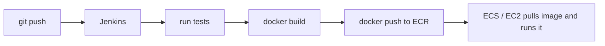

# Warm-up: Docker, Jenkins, and the AWS flow

These are the questions we discussed before starting the roadmap. Each one comes back later in its own full lesson.

---

## 1. Jenkins vs Docker

**Docker** packs your app into a box (a "container"). **Jenkins** is the robot that builds, tests, and ships that box every time you change code.

**Analogy:**
- **Docker** is a lunchbox. Your food (the app) goes in with everything it needs, so it tastes the same wherever you open it.
- **Jenkins** is the kitchen manager. Each time the recipe (your code) changes, he cooks the food, checks it, packs it, and sends it out.

| | Docker | Jenkins |
|---|---|---|
| What it is | A tool that runs apps inside **containers** (small isolated boxes) | A **CI/CD** server (Continuous Integration / Continuous Delivery): it builds and ships your code on every change |
| What problem it solves | "It works on my machine but not on yours" | "I don't want to build, test and deploy by hand every time" |
| Main thing you write | `Dockerfile`: the recipe for the box | `Jenkinsfile`: the list of steps to run |

**The one trap:** they don't compete. Docker is the **package**. Jenkins is the **automation** that makes and ships the package.

---

## 2. Multi-stage Docker builds

A **multi-stage build** uses one Dockerfile with two or more steps. The first step **builds** your app. The last step **keeps only the finished app** and leaves the build tools behind.

**Analogy:** you bake a cake in a full kitchen, then deliver only the cake in a small box, not the whole kitchen.

| Benefit | Why it matters |
|---|---|
| **Smaller image** | Downloads and starts faster |
| **Safer** | Compilers and dev tools aren't shipped, so attackers have fewer tools to use |
| **One file** | No separate "build" and "run" Dockerfiles |
| **No secrets left behind** | Anything used only while building stays in the build stage |

```dockerfile
# Stage 1: big image that has the Go compiler, named "builder"
FROM golang:1.22 AS builder
# Work inside the /app folder
WORKDIR /app
# Copy your source code in
COPY . .
# Compile the code into one program file called "myapp"
RUN go build -o myapp

# Stage 2: tiny image, no compiler
FROM alpine:3.20
# Take ONLY the finished program from stage 1
COPY --from=builder /app/myapp /myapp
# Run it when the container starts
CMD ["/myapp"]
```

**The one trap:** only the **last** stage becomes your image. Anything you don't copy forward with `COPY --from=` is gone.

---

## 3. Java: JDK vs JRE

- **JDK** (Java Development Kit): compiler + tools. Needed to **build**.
- **JRE** (Java Runtime Environment): just enough to **run** Java.

| | Build stage | Final stage |
|---|---|---|
| Java | JDK + Maven + source | JRE + `.jar` |
| Go | Go compiler + source | just the program |

| File | What it is | In the final image? |
|---|---|---|
| `.java` | Source code you write | No |
| `.class` / `.jar` | Bytecode the JRE runs | Yes |
| JRE | The program that runs bytecode | Yes |

Plain `alpine` has no Java, so `java -jar app.jar` fails with `java: not found`. Use an image that already has a JRE:

```dockerfile
# Option A (easiest): an image that already has the JRE on Alpine
FROM eclipse-temurin:21-jre-alpine
```

```dockerfile
# Option B: start from plain Alpine
FROM alpine:3.20
# then install the JRE yourself with Alpine's package manager (apk)
RUN apk add --no-cache openjdk21-jre
```

---

## 4. Where DevOps fits

**DevOps** = **Dev**elopment + **Op**eration**s**: a way of working where building and running software are done together, and most steps are automated.

| DevOps step | Common tool |
|---|---|
| Store code | Git, GitHub |
| Build and test automatically (CI/CD) | Jenkins, GitHub Actions |
| Package the app | Docker |
| Run many containers | Kubernetes |
| Create servers from code | Terraform |
| Watch the app | Prometheus, Grafana |

**The one trap:** DevOps is **not** a tool, so you can't "install DevOps". It's the practice, and the tools support it.

---

## 5. The real-life flow: push → Jenkins → ECR → ECS



| Step | Who does it | Command or action |
|---|---|---|
| Build image | Jenkins | `docker build -t myapp:v1 .` |
| Store image | Jenkins sends it to ECR | `docker push <ecr-url>/myapp:v1` |
| Run app | ECS or EC2 | pulls `myapp:v1` and starts the container |

- **ECR** (Elastic Container Registry): storage for images, like GitHub for images.
- **ECS** (Elastic Container Service): pulls the image and runs it.

**The one trap:** ECR doesn't **run** anything. It only stores images.

---

## 6. Tags, rollback, and lifecycle rules

Why tag images (`v1`, or the git commit hash like `myapp:a1b2c3d`) instead of using `latest`:
- **Rollback:** if `v2` breaks, redeploy `v1` in seconds.
- **Clarity:** `latest` is a moving label, so you can't tell which version is actually running.

**ECR lifecycle policies** delete old images automatically. If they delete too much, you can't roll back.

| Fix | How |
|---|---|
| Keep enough images | "Keep the last 30", not "keep the last 3" |
| Protect release images | Tag releases like `prod-v1` and only expire tags without that prefix |
| Expire by age, not count | Delete untagged images older than 14 days |

**The one trap:** an image that is **currently running** in ECS can still be deleted from ECR. Nothing breaks right away. But the next time ECS needs to pull it again, for example to start a new task, the pull fails.
