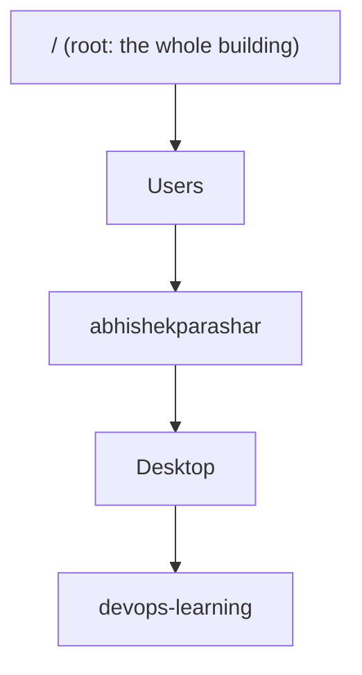

# Lesson 0.1: Terminal and moving around

Every later tool, from Docker to Jenkins to Kubernetes, is used from the terminal.

## The idea

The **terminal** is a chat window with your computer. You type a command, and the computer does it and replies.
Real servers have no mouse and no screen, so this is the only way to control them.

**Analogy:** your computer's folders are a building. Each folder is a room, and rooms can contain more rooms.
In the terminal you're always standing in exactly one room.



## Words

| Word | Full name | What it does | Example |
|---|---|---|---|
| terminal | – | The window you type in | The Terminal app on your Mac |
| shell | – | The program that understands your commands | zsh (Mac), bash (Linux) |
| path | – | The address of a room | `/Users/abhishekparashar/Desktop` |
| `pwd` | print working directory | "Which room am I in?" | `pwd` |
| `ls` | list | "What's in this room?" | `ls` |
| `cd` | change directory | "Go to that room" | `cd Desktop` |
| `~` | home | Shortcut for your home folder | `cd ~` |

## The one trap to remember

A path that starts with `/` is a **full address** (an *absolute* path), so it works from anywhere.
A path without `/` is **"from where I'm standing now"** (a *relative* path).
For example, `cd Desktop` only works if Desktop is inside your current folder.

## Why it matters

In a real job you'll SSH into servers that have no screen at all. Every fix you make there will be typed.

## Your turn

1. Open Terminal and run `pwd`, then `ls`. What do you see?
2. Without running it: does `cd devops-learning` work right after you open Terminal? Why or why not?

## Answers

1. `pwd` printed `/Users/abhishekparashar`, the home folder.
2. **No.** `devops-learning` is inside `Desktop`, not inside home. A relative path only looks in the room you're standing in.

```bash
# Typo: the terminal matches names exactly, letter by letter
cd devops-leanring
# zsh: cd: no such file or directory: devops-leanring

# Works, but only from home (relative path)
cd Desktop/devops-learning

# Works from anywhere (~ means home, so this is a full address)
cd ~/Desktop/devops-learning
```
