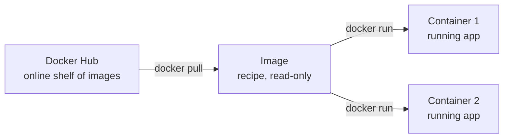

# Lesson 2.1: Image vs container

## The idea

An **image** is like a recipe. A **container** is a dish cooked from that recipe.
One recipe can make many dishes, and throwing away a dish doesn't change the recipe.



## Words

| Word | Full name | What it does | Example |
|---|---|---|---|
| Image | Docker image | A frozen package: the app plus everything it needs. You can't change it. | `nginx`, `hello-world` |
| Container | – | A running copy of an image | `docker run nginx` |
| VM | Virtual Machine | A full fake computer with its **own** operating system (OS) | Ubuntu running inside VirtualBox |
| Docker Engine | – | The background program on your laptop that actually runs containers | Starts when Docker Desktop opens |
| Docker Hub | – | A website that stores public images, like an app store | hub.docker.com |

## The one trap to remember

A container is **not** a small VM.
A VM carries its own whole OS. A container shares your computer's OS **kernel** (the core part of the OS that talks to the hardware) and only packs the app and its files.
That's why containers are so much lighter.

## Why it matters

| | VM | Container |
|---|---|---|
| Start time | Minutes | About 1 second |
| Size | Several GB | A few MB to a few hundred MB |
| How many fit on one laptop | A few | Dozens |

## Your turn

1. You start 3 containers from one image. How many images do you have, and how many containers?
2. Run `docker run hello-world` in your terminal and tell me the first line that starts with "Hello".

## Answers

1. **1 image, 3 containers.** One recipe, three dishes.
2. `Hello from Docker!`

## Try it: see images and containers

| Command | Question it answers |
|---|---|
| `docker ps` | Which containers are **running right now**? (`ps` = process status) |
| `docker ps -a` | Which containers exist, **including stopped ones**? (`-a` = all) |
| `docker images hello-world` | Do I have the `hello-world` image? |

Real output on this Mac after `docker run hello-world`:

```text
$ docker ps
CONTAINER ID   IMAGE     COMMAND   CREATED   STATUS    PORTS     NAMES

$ docker ps -a
CONTAINER ID   IMAGE         COMMAND    CREATED          STATUS                      NAMES
bc9ccc6c1573   hello-world   "/hello"   44 seconds ago   Exited (0) 44 seconds ago   gifted_goodall

$ docker images hello-world
IMAGE                ID             DISK USAGE   CONTENT SIZE
hello-world:latest   5e2309035332       22.6kB         10.3kB
```

- `docker ps` is empty because `hello-world` prints its message and stops.
- The stopped container is **still there**. `Exited (0)` means it finished, and `0` means "no error".
- The image is **still there** too, so the next `docker run hello-world` won't download it again.
