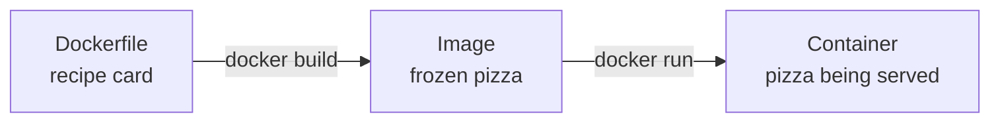

# Lesson 2.2: Writing a Dockerfile

## The idea

A **Dockerfile** is a recipe card for an image. It's a plain text file with one instruction per line, read from top to bottom.

**Analogy:** making a pizza.
1. Start from store-bought dough (`FROM`).
2. Pick your counter (`WORKDIR`).
3. Bring your toppings from home (`COPY`).
4. Bake it now (`RUN`).
5. Put a sign on the window: "served at window 8080" (`EXPOSE`).
6. Write down what to do when a customer orders (`CMD`).



## Words

| Word | What it does | Example |
|---|---|---|
| `FROM` | The base image you start from. Always the first line. | `FROM python:3.12-slim` |
| `WORKDIR` | The folder inside the image where the next steps happen (created if missing) | `WORKDIR /app` |
| `COPY` | Copies files from your laptop into the image | `COPY app.py .` |
| `RUN` | Runs a command **while building** the image | `RUN pip install flask` |
| `EXPOSE` | A note saying which port the app listens on. It doesn't open the port. | `EXPOSE 8080` |
| `CMD` | The command to run **when a container starts** | `CMD ["python", "app.py"]` |
| Build context | The folder you send to Docker when you build. `COPY` can only see files inside it. | The `.` in `docker build -t myapp:v1 .` |

## The one trap to remember

**`RUN` happens once, at build time. `CMD` happens every time a container starts.**
- `RUN pip install flask`: install once, and the result is saved inside the image.
- `CMD ["python", "app.py"]`: start the app each time someone runs the image.

If you write `RUN python app.py`, the build tries to start your app and gets stuck there, because a web app never finishes.

## Why it matters

Without a Dockerfile, every new teammate and every server needs a setup guide: install Python, install the libraries, and hope the versions match.
With one, setup is `docker build` once, and the same image runs everywhere.

## Your turn

1. You need to install a library and then start your app. Which one goes in `RUN`, and which one goes in `CMD`?
2. In `docker build -t myapp:v1 .`, what does the `.` at the end mean?

## Answers

**In your words:** a Dockerfile is used to create an image with `docker build`, and then `docker run` runs a container from it. Build once, run many times.

1. **Install the library → `RUN`** (done once, saved inside the image). **Start the app → `CMD`** (done every time a container starts).
2. **The `.` is the build context, and it means "this folder".** This is the same `.` as in Lesson 0.1: a relative path, "the room I'm standing in".

Read the command piece by piece:

| Piece | Meaning |
|---|---|
| `docker build` | Make an image |
| `-t myapp:v1` | `-t` = tag: give the image a name (`myapp`) and a version (`v1`) |
| `.` | Use the current folder as the build context |

Docker packs up everything in that folder and hands it to the builder. `COPY` can only take files from that pack.

```text
myapp/              ← you cd here, then run: docker build -t myapp:v1 .
├── Dockerfile
└── app.py          ← COPY app.py .  works (inside the context)

~/Documents/notes.txt  ← COPY can't reach this (outside the context)
```

**Quick check:** before `docker build -t myapp:v1 .`, which folder do you `cd` into?
**Answer:** the app's folder, the one that has the Dockerfile and the app files. Remember: `docker build` makes an **image**, not a container.

## Build it, Part 1: the app

```bash
# make a folder for practice code (-p = also create the parent folders if they're missing)
mkdir -p ~/Desktop/devops-learning/practice/first-image
# go inside it
cd ~/Desktop/devops-learning/practice/first-image
```

Write `app.py` using only commands (no editor):

```bash
# > writes into the file (erases what was there before)
echo '# print one line so we can see the app ran' > app.py
# >> adds to the end of the file (keeps what's already there)
echo 'print("Hello from my first image!")' >> app.py
# show what's in the file
cat app.py
```

| Symbol | Meaning | Trap |
|---|---|---|
| `>` | Write to the file, replacing everything in it | Run it twice and the first line is gone |
| `>>` | Add to the end of the file | Run it twice and you get the line twice |
| `'...'` | Single quotes keep the text exactly as typed | That's how the `"` inside `print("...")` survives |

Real output:

```text
% cat app.py
# print one line so we can see the app ran
print("Hello from my first image!")
```

## Build it, Part 2: the Dockerfile

```bash
# start from an image that already has Python 3.12 (slim = smaller version)
echo 'FROM python:3.12-slim' > Dockerfile
# work inside the /app folder in the image
echo 'WORKDIR /app' >> Dockerfile
# copy app.py from your laptop into /app
echo 'COPY app.py .' >> Dockerfile
# when a container starts, run: python app.py
echo 'CMD ["python", "app.py"]' >> Dockerfile
# check the file
cat Dockerfile
```

- The file name must be exactly `Dockerfile`: capital `D`, no extension. `docker build` looks for that name by default.
- The first line uses `>` to start a fresh file. Every other line uses `>>` to add to it.
- In `COPY app.py .`, the `.` means "the current folder inside the image", which is `/app` because of `WORKDIR`.
- There's no `RUN` line because this app needs no libraries.

Real output:

```text
% cat Dockerfile
FROM python:3.12-slim
WORKDIR /app
COPY app.py .
CMD ["python", "app.py"]
```

**Quick question:** what if the last `echo` used `>` instead of `>>`?
**Answer:** `>` replaces the existing content, so the Dockerfile would contain only `CMD ["python", "app.py"]`. With no `FROM` line, the build fails.

## Build it, Part 3: build and run

```bash
# build an image from the Dockerfile in this folder (.), named myapp, version v1
docker build -t myapp:v1 .
# start a container from that image; --rm deletes the container when it stops
docker run --rm myapp:v1
```

Expected (tested):

```text
... naming to docker.io/library/myapp:v1 ...
Hello from my first image!
```

Real output:

```text
% docker run --rm myapp:v1
Hello from my first image!
```

Python ran without being installed on the Mac. It lives inside the image.
