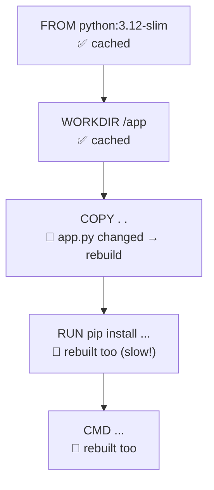

# Lesson 2.3: Layers and caching

## The idea

Each line in a Dockerfile makes one **layer**, a saved snapshot of the image at that point.
Layers stack on top of each other like floors of a building.

When you rebuild, Docker checks each line from the top: "Did this line or its files change?"
- **No** → reuse the saved layer (the **cache**). Instant.
- **Yes** → rebuild this layer **and every layer below it**.

**Analogy:** a tower of building blocks. Swap a block in the middle, and every block above it has to come off and go back on. The blocks underneath stay put.

## Words

| Word | Full name | What it does | Example |
|---|---|---|---|
| Layer | Image layer | A saved snapshot made by one Dockerfile line | `RUN pip install flask` makes one layer |
| Cache | Build cache | Layers saved from earlier builds, reused when nothing changed | `CACHED` in the build output |
| `.dockerignore` | – | A list of files to leave out of the build context, like `.gitignore` | `.git`, `node_modules`, `.env` |

## The one trap to remember

**Once one line changes, every line below it rebuilds, even lines that didn't change.**
So put things that rarely change at the **top** (installing libraries) and things that change often at the **bottom** (your code).

| Slow order | Fast order |
|---|---|
| `COPY . .` (all code) | `COPY requirements.txt .` (list of libraries only) |
| `RUN pip install -r requirements.txt` | `RUN pip install -r requirements.txt` |
| | `COPY . .` (all code) |

## Why it matters

Measured on this Mac: an app with one library (Flask). Change `app.py`, then rebuild:

| Order | Rebuild time |
|---|---|
| Slow order | 2.52 s (reinstalls Flask every time) |
| Fast order | 0.58 s (Flask install reused from cache) |

With one small library the gap is about 4×. Real apps install dozens of libraries, so the slow order can cost minutes on **every** build, on your laptop and in CI.

## Your turn

1. In the slow order, you change only `app.py`. Why does `pip install` run again?
2. In the fast order, which line rebuilds when you add a new library to `requirements.txt`, and does `pip install` run again?
